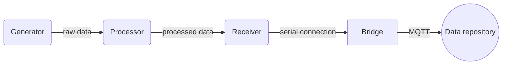

# WasmMeshDemo
Demo project for data stream processing using WebAssembly and [painless mesh](https://gitlab.com/painlessMesh/painlessMesh) (WiFi mesh library for esp32 and esp8266).

## Overview

- Generator (ESP32): A mesh node generating and transmitting random numbers.
- Processor (ESP32): The processor gets data from the generator and calculate average using WebAssembly module.
- Receiver (ESP32): This node requires serial connection with a PC like RaspberryPi. It reveives data from the processor and send them via serial communication.
- Bridge (PC / RaspberryPi): A bridge between Mesh and an another network, for example, MQTT communication. It allows for reading data from a MCU via serial communication and transmitting message via MQTT. The program requires NodeJS, serial port like USB, and WiFi or Ethernet.
